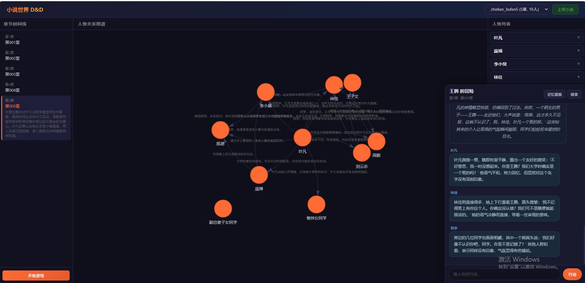

# 小说世界 D&D

沉浸式小说角色扮演游戏系统。将小说文本转化为可交互的世界，玩家可以穿越进小说世界，夺舍已有角色或创建自定义身份，与 NPC 进行对话式交互。



## 核心特性

- **四层时空记忆系统**：L1 长期人设（只读）→ L2 章节状态（仅追加）→ L3 场景交互（读写）→ L4 决策上下文（临时），严格绑定时空坐标，杜绝角色认知超纲
- **时空坐标体系**：`{小说ID}-{章节号}-{场景ID}-{事件序号}` 四级坐标，记忆检索、Agent 决策的第一过滤条件
- **LangGraph 决策 DAG**：时空锁死 → 记忆召回 → 认知校验 → 决策生成 → 合规校验 → 记忆更新，全闭环不可绕过
- **记忆驱动的 Agent**：每个 NPC 的认知完全由当前时空的有效记忆决定，不使用大模型预训练知识
- **人物关系图谱**：基于 vis.js 的交互式关系图谱，支持按章节过滤
- **双重身份模式**：夺舍已有角色 / 杜撰全新身份
- **角色记忆面板**：实时查看角色的性格、背景、能力、人际关系等状态

## 架构概览

```
玩家输入
    ↓
[时空坐标锁定] ← 章节号 + 场景ID + 事件序号
    ↓
[记忆召回] ← L1 人设 + L2 章节状态 + L3 场景交互
    ↓  (时空硬过滤 → 语义向量排序)
[认知校验] ← 知识边界 / 能力边界 / 时态边界
    ↓
[决策生成] ← LLM + 记忆注入的 System Prompt (temp=0.1)
    ↓
[合规校验] ← 人设一致性 / 信息溯源 / 幻觉检测
    ↓  (不通过则重试，最多2次)
[记忆更新] ← 写入 L3 场景记忆
    ↓
NPC 回复
```

## 技术栈

| 层 | 技术 |
|---|------|
| 后端框架 | FastAPI + Uvicorn |
| Agent 框架 | LangGraph (决策 DAG) |
| 知识图谱 | LightRAG (lightrag-hku) |
| LLM | OpenAI 兼容 API (MiMo) |
| Embedding | SiliconFlow BGE-M3 (1024 dim) |
| 向量检索 | numpy 余弦相似度 + 时空元数据过滤 |
| 前端 | 原生 JS + vis.js + CSS |
| 数据模型 | Pydantic v2 |

## 快速开始

### 1. 安装依赖

```bash
python -m venv venv
source venv/bin/activate
pip install -r requirements.txt
```

### 2. 配置 API Key

编辑 `backend/config.py`，设置 LLM 和 Embedding API：

```python
LLM_API_KEY = "your-key"
LLM_BASE_URL = "https://your-llm-endpoint/v1"
LLM_MODEL = "your-model"

EMBEDDING_API_KEY = "your-key"
EMBEDDING_BASE_URL = "https://your-embedding-endpoint/v1"
EMBEDDING_MODEL = "BAAI/bge-m3"
```

或通过环境变量：

```bash
export LLM_API_KEY="your-key"
export LLM_BASE_URL="https://your-endpoint/v1"
```

### 3. 启动服务

```bash
uvicorn backend.main:app --host 0.0.0.0 --port 8000
```

访问 `http://localhost:8000`。

### 4. 上传小说

点击「上传小说」按钮，选择 `.txt` 文件。系统将自动：

1. 按章节格式切分文本
2. 提取人物列表和关系
3. 构建章节级角色状态时间线
4. 提取关键场景
5. **迁移至四层记忆系统**（自动生成 L1/L2 记忆片段 + 向量嵌入）

## 使用流程

```
上传小说 → 选择章节 → 选择身份（夺舍/杜撰）→ 选择场景 → 进入世界
```

### 夺舍模式

选择一个已有角色，以穿越者身份使用该角色的身体和记忆。NPC 会根据原著关系和当前时空的记忆与你互动。系统严格保证角色不会说出超出当前章节认知范围的内容。

### 杜撰模式

创建全新角色，以外来者身份进入小说世界。原著角色不认识你，会根据各自性格和记忆决定如何对待你。

### 对话交互

输入你的行动，系统会返回：
- **旁白**：环境描述和事件叙述
- **NPC 对话**：每个在场 NPC 根据性格、记忆和认知边界做出回应
- **GM 提示**：当行为超出认知边界时给出提示

## 四层记忆系统

| 层级 | 名称 | 读写权限 | 时空绑定 | 存储 |
|------|------|----------|----------|------|
| L1 | 长期记忆（人设库） | 只读 | 全时空生效 | `memory/l1/{role_id}.json` |
| L2 | 中期记忆（状态库） | 仅追加 | 绑定章节号 | `memory/l2/ch_{N}.json` |
| L3 | 短期记忆（交互库） | 读写 | 绑定场景+事件 | 内存，归档至 L2 |
| L4 | 工作记忆（决策上下文） | 临时 | 单回合有效 | 内存，回合后清空 |

### 记忆检索流程

1. **时空硬过滤**：仅返回 `valid_time_coord ≤ 当前坐标 ≤ expire_time_coord` 的记忆
2. **语义向量召回**：对过滤后的记忆池做余弦相似度检索
3. **优先级排序**：L1 > L2 > L3，同层按时间近优先

### 记忆写入规则

- 时空不可逆：只能写入当前或未来的时空坐标，绝不修改历史记忆
- 场景级归档：场景结束时 L3 短期记忆归档至 L2 中期记忆
- 私有/共享隔离：角色私有记忆仅自己可检索，场景公共记忆同场景角色共享

## API 端点

### 游戏接口

| 方法 | 路径 | 说明 |
|------|------|------|
| GET | `/novels` | 列出所有已上传小说 |
| POST | `/novel/upload` | 上传小说并提取数据 |
| GET | `/novel/{id}/chapters` | 获取章节列表 |
| GET | `/novel/{id}/characters` | 获取角色列表（支持 `?chapter_id=`） |
| GET | `/novel/{id}/graph` | 获取关系图谱数据 |
| GET | `/novel/{id}/scenes` | 获取场景列表 |
| POST | `/game/start` | 开始游戏会话 |
| POST | `/game/{id}/chat` | 发送游戏消息 |
| GET | `/game/{id}/state` | 获取会话状态 |
| DELETE | `/game/{id}` | 结束游戏会话 |

### 记忆接口

| 方法 | 路径 | 说明 |
|------|------|------|
| GET | `/novel/{id}/memory/{role_id}` | 获取角色记忆状态 |
| POST | `/novel/{id}/memory/migrate` | 触发记忆数据迁移 |
| GET | `/novel/{id}/memory/stats` | 获取记忆片段统计 |

## 项目结构

```
backend/
  config.py           # API 配置、Agent 参数、Prompt 模板
  models.py           # Pydantic 数据模型（游戏会话、角色状态）
  main.py             # FastAPI 路由（游戏 + 记忆接口）
  chat.py             # 游戏会话管理（自动路由到记忆/传统路径）
  world_engine.py     # 世界状态机 + 认知校验 + 传统 GameMaster
  extraction.py       # 小说提取管线（LightRAG + 时间线 + 记忆迁移）
  chapter_manager.py  # 章节切分和管理
  # --- 记忆系统 ---
  spatiotemporal.py   # 时空坐标（TimeCoord）解析、比较、序列化
  memory_models.py    # 记忆片段（MemoryFragment）数据模型
  memory_store.py     # 四层存储引擎 + 时空过滤 + 向量检索
  memory_manager.py   # 记忆管理高层 API
  migrate_memory.py   # 现有数据 → 四层记忆迁移
  # --- Agent 框架 ---
  agent_state.py      # LangGraph 状态 schema（AgentState）
  agent_prompts.py    # 动态 Prompt 模板（角色系统提示、校验提示）
  agent_tools.py      # LangGraph 节点函数（召回、校验、生成、更新）
  agent_graph.py      # LangGraph 决策 DAG 编译
  multi_agent.py      # 多 Agent 协调器（记忆增强的单次生成）
frontend/
  index.html          # 页面结构
  css/style.css       # 暗色主题样式
  js/
    app.js            # 主流程编排
    timeline.js       # 章节时间线
    identity.js       # 身份选择面板
    scene.js          # 场景选择
    chat.js           # 游戏对话渲染
    graph.js          # vis.js 关系图谱
    character.js      # 角色列表面板
data/
  novels/             # 按小说组织的数据
    {novel_id}/
      raw.txt         # 原始文本
      chapters.json   # 章节列表
      characters.json # 角色数据
      scenes.json     # 场景数据
      timeline.json   # 角色状态时间线
      rag_storage/    # LightRAG 存储
      memory/         # 四层记忆数据
        l1/           # L1 长期人设（只读）
        l2/           # L2 章节状态（追加）
        embeddings/   # 向量嵌入索引
        meta.json     # 迁移元数据
  sessions/           # 游戏会话持久化
```

## 设计原则

1. **时空红线**：时空坐标是所有记忆检索、Agent 决策的第一过滤条件，无例外
2. **记忆即认知**：没有记忆就没有认知，Agent 只能使用当前时空的有效记忆
3. **向后兼容**：没有记忆数据的小说自动回退到传统 GameMaster 路径
4. **性能优先**：记忆增强路径保持与传统路径相同的 LLM 调用次数（2次）

## 许可

MIT
